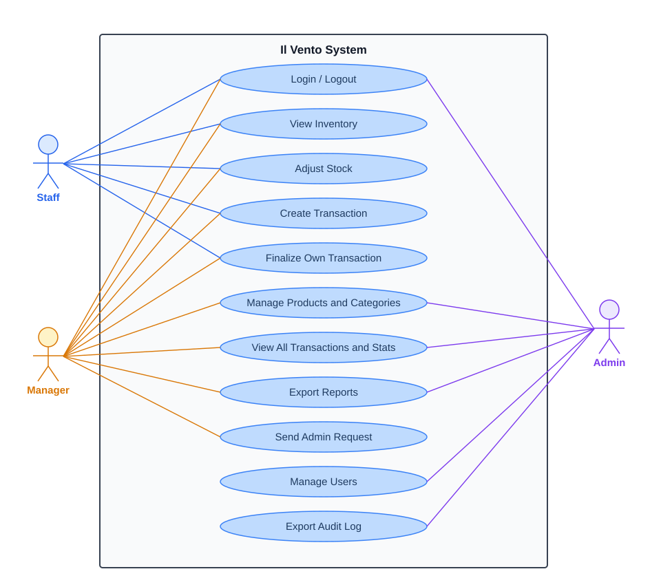
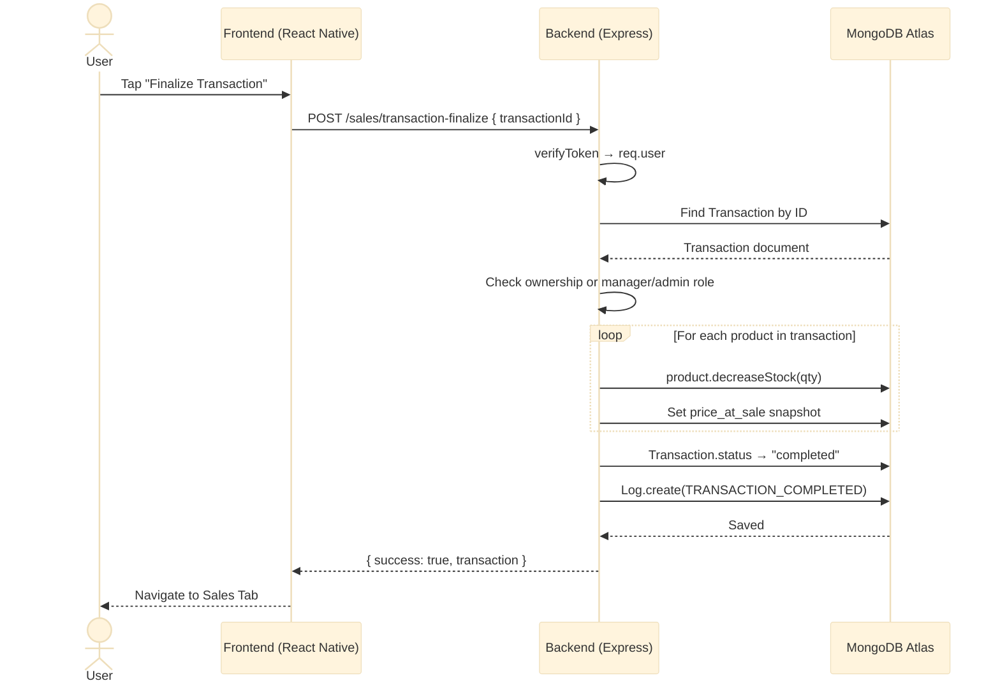
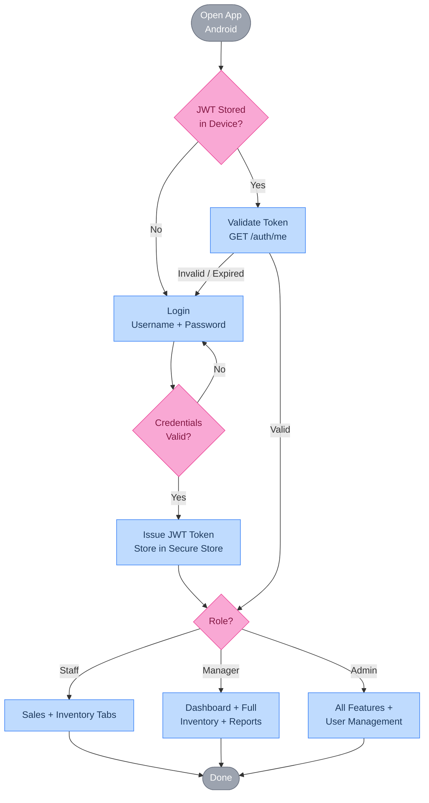
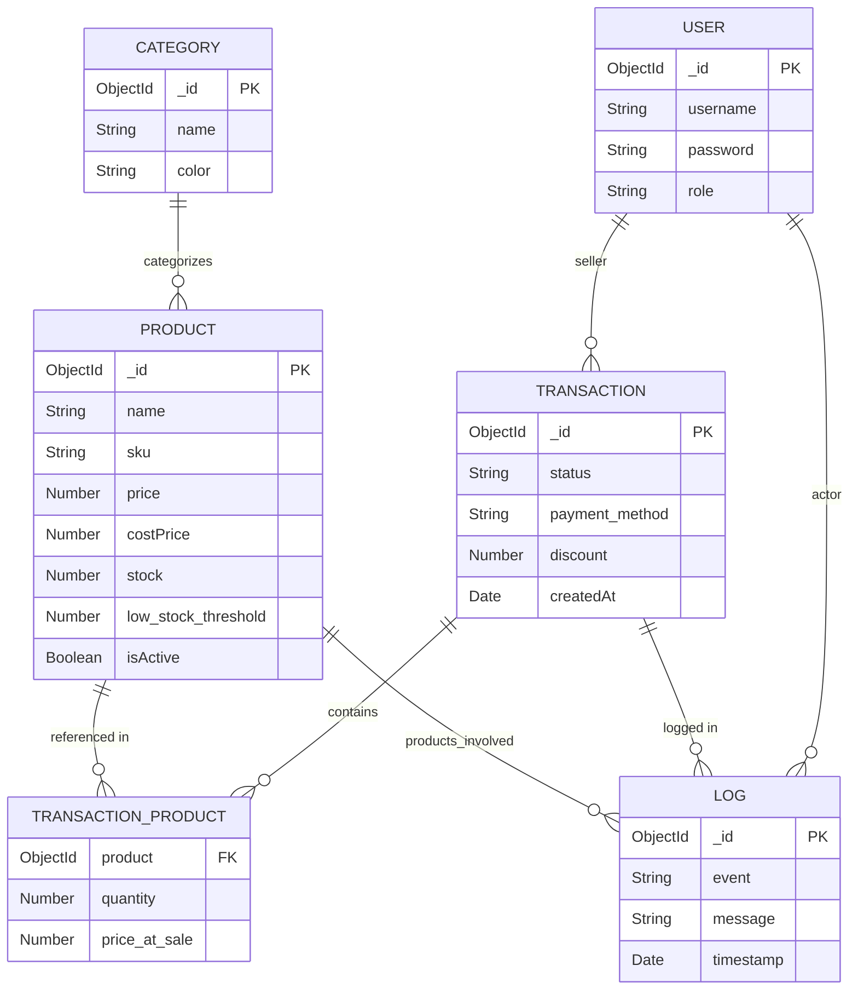

# Software Engineering Project Documentation

**Project Title:** Il Vento — Inventory Management System
**Student Name:** Sheidrix Bill T. Ducao
**Course:** Software Engineering 1 (CS304)
**Instructor:** Michaelangelo R. Serrano
**Date:** March 24, 2026

---

## Introduction

### Overview

Il Vento is a full-stack inventory and point-of-sale (POS) management system built for retail businesses. It allows staff to process sales transactions, managers to control inventory and generate reports, and administrators to manage users — all from a mobile app built with React Native and backed by a Node.js/Express REST API connected to MongoDB Atlas.

### Problem Statement

Small retail businesses often rely on manual records or disconnected tools for inventory tracking and sales processing. This makes it difficult to maintain accurate stock counts, audit financial activity, and make data-driven decisions in real time. There is a need for an integrated, role-aware system accessible on mobile devices.

### Purpose

To build a mobile-first, role-based inventory management and POS system that unifies product management, transaction processing, and reporting into a single application — reducing manual errors and providing management with real-time operational visibility.

---

## Objectives

1. **Authentication & RBAC:** Allow users to log in with role-based access control (admin, manager, staff) that gates features at both the API and UI levels.
2. **Inventory Management:** Enable managers and admins to create, update, archive, and restore products and categories, with full stock adjustment history.
3. **Transaction Processing:** Let all authenticated users create and manage sales transactions through a full lifecycle (pending → completed/cancelled), with a dedicated POS mode for fast entry.
4. **Reporting & Exports:** Provide managers and admins with revenue statistics, top-selling products, low-stock alerts, and downloadable CSV/PDF reports.
5. **Audit Trail:** Record every significant system action (user events, inventory changes, transaction events) to a structured audit log for accountability.

---

## System Requirements

### Functional Requirements

- The system must allow users to log in and validate their session on every app launch via a stored JWT.
- The system must enforce role-based permissions: staff can create/own transactions and adjust stock; managers can additionally manage products, categories, and view all data; admins additionally manage users and export audit logs.
- The system must support full product CRUD with soft-delete (archive/restore) and paginated, searchable product listings.
- The system must support category management with color-coded badges.
- The system must allow transactions to be created, edited while pending, finalized (which decrements stock and snapshots prices), or cancelled.
- The system must display a real-time dashboard with stats: total items sold, total stock value, today's sales, and total revenue.
- The system must generate exportable reports in CSV and PDF formats for transactions, inventory, low-stock items, and audit logs.
- The system must write a structured audit log entry for every significant mutation.

### Non-Functional Requirements

- The system must be mobile-first, targeting Android via a native APK built with EAS Build.
- All API routes (except login) must be protected by JWT authentication.
- The backend must be stateless and deployable to a cloud host (Render).
- The database must be hosted on MongoDB Atlas with no local storage of production data.
- The UI must support light and dark themes, respecting the system preference by default.
- Passwords must never be logged or stored in plaintext (bcrypt hashing required).

---

## System Design

### 1. Use Case Diagram

This diagram illustrates how the three user roles (Staff, Manager, Admin) interact with the system's core features: authentication, inventory management, transaction processing, reporting, and user administration.

---

### 2. Sequence Diagram

This diagram shows the sequence of events when a staff member finalizes a sales transaction: the frontend sends a finalize request → the backend verifies the JWT and ownership → stock is decremented per product → `price_at_sale` is snapshotted → a `TRANSACTION_COMPLETED` log entry is written → the response is returned to the client.

---

### 3. Activity Diagram

This diagram shows the activity flow of the transaction lifecycle: a user opens a new transaction and adds products from inventory → the transaction is saved as **pending** → the user (or a manager) can edit products, then either **finalize** (stock decremented, status → completed) or **cancel** (stock unchanged, status → cancelled).

---

### 4. Database Design

The system uses five MongoDB collections. Key relationships:

- `Product` references `Category` (optional)
- `Transaction` references `User` (seller) and embeds `Product` references with `quantity` and `price_at_sale`
- `Log` references `User` (actor), optionally `User` (target), `Transaction`, and `Product` documents

**Entities and core fields:**

| Collection | Key Fields |
|---|---|
| **User** | `username`, `password` (bcrypt), `role` (admin/manager/staff) |
| **Category** | `name` (unique), `color` (hex) |
| **Product** | `name`, `sku` (sparse unique), `price`, `costPrice`, `stock`, `low_stock_threshold`, `category` → Category, `isActive` |
| **Transaction** | `status` (pending/completed/cancelled), `seller` → User, `products[]` (product ref + qty + price_at_sale), `payment_method`, `discount` |
| **Log** | `event` (event code), `message`, `actor` → User, `transaction_id`, `products_involved[]`, `metadata`, `timestamp` |

---

## Tech Stack

| Layer | Technology |
|---|---|
| Frontend | React Native 0.81, Expo SDK 54, Expo Router v6 |
| UI Library | react-native-paper v5 (Material Design 3) |
| HTTP Client | axios |
| Auth Storage | expo-secure-store |
| Backend | Node.js + Express v5 (ES modules) |
| Database | MongoDB Atlas via Mongoose v9 |
| Auth | JWT (jsonwebtoken), bcryptjs |
| Security | helmet, cors |
| Logging | morgan (HTTP), MongoDB Log collection (audit trail) |
| Export | csv (json2csv), PDF (pdfkit / expo-print) |
| Build | EAS Build (Android APK) |
| Hosting | Render (backend) |

---

## Conclusion

### Summary

Il Vento is a mobile-first inventory management and POS system that centralizes product management, sales transaction processing, and operational reporting under a single role-based application. It gives staff a fast interface for recording sales, gives managers full control over inventory and visibility into revenue data, and gives administrators complete oversight of users and the audit trail.

### Future Work

- **Order tracking & receipts:** Generate and share printable receipts per transaction.
- **Barcode scanning:** Use the device camera to scan product barcodes during POS entry.
- **Push notifications:** Alert managers when stock falls below the low-stock threshold.
- **iOS support:** Extend the EAS build configuration and test on iOS devices.
- **Request validation:** Add schema-level input validation (e.g., Joi or Zod) on all backend routes.
- **Automated testing:** Introduce unit and integration tests for route handlers and business logic.

---

## References

- Expo Documentation — https://docs.expo.dev
- React Native Documentation — https://reactnative.dev/docs
- Mongoose Documentation — https://mongoosejs.com/docs
- Express.js Documentation — https://expressjs.com
- MongoDB Atlas Documentation — https://www.mongodb.com/docs/atlas
- JSON Web Tokens (JWT) — https://jwt.io/introduction
- EAS Build — https://docs.expo.dev/build/introduction
- react-native-paper — https://callstack.github.io/react-native-paper
